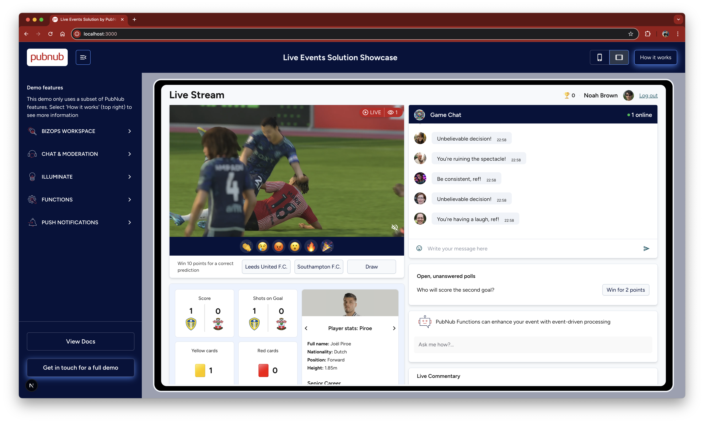

# PubNub Live Events Solution Demo

Solution showcase to demonstrate how PubNub can enhance your live event, whether it is a sports event, a concert, or any other streamed media event.

## Demo

A hosted version of this demo can be found at **[https://pn-solution-live-events.netlify.app/](https://pn-solution-live-events.netlify.app/)**



## Things to Try:

- **Tap reaction emojis** below the live stream to trigger Illuminate-powered features:
  - Press emojis multiple times to upgrade them in real-time
  - Trigger sentiment-based polls (😡 for anger polls, 🎉 for celebration polls)
  - Unlock dynamic premium ad offers
- **Participate in dynamically triggered polls** that appear based on fan engagement
- Send messages in the chat window (log in under a separate window to receive the message)
- Explore the left-hand menu to see the portal data that powers the demo:
  - **Illuminate Dashboards** - Real-time analytics and decision engines
  - Users and Channels
  - Message moderation
  - PubNub Functions


## What does this demo show?

### 🌟 PubNub Illuminate Features (Primary Focus)

- **Sentiment-Driven Polls**: Illuminate monitors fan reactions in real-time and automatically triggers contextual polls when specific emotional thresholds are reached (PubNub Illuminate)
- **Dynamic Emoji Upgrades**: When fans tap reactions enough times, Illuminate upgrades emojis in real-time to enhanced versions (PubNub Illuminate)
- **Dynamic Ad Serving**: Illuminate triggers premium ad offers based on fan engagement patterns and sentiment (PubNub Illuminate)
- **Real-Time Analytics**: Dashboard showing engagement metrics, sentiment tracking, and actionable insights in milliseconds (PubNub Illuminate)

### Fan Engagement Features

- **Live Reactions**: Fans can react to events with emojis that float across the screen (PubNub Messaging)
- **Interactive Polls**: Real-time voting with instant results visualization (PubNub Messaging, Functions)
- **Gamification**: Users earn points by engaging with polls, ads, and content (App Context)
- **Match Stats**: Real-time statistics synchronized with the video feed (PubNub Messaging)
- **Live Commentary**: Automated commentary synchronized with game events (PubNub Messaging)
- **Presence Tracking**: Number of people watching the live event (PubNub Presence)

### Chat Features

- Send and receive messages (PubNub Chat SDK)
- React to messages with emojis (PubNub Chat SDK)
- Tag users and receive notifications when mentioned (PubNub Chat SDK)
- User moderation: Banning or Muting users (PubNub Channel Monitor)
- Number of chat participants (PubNub Presence)

### Additional Features

- Mobile or Tablet responsive view
- User and Channel Management (BizOps Workspace)
- Push Messages for web and mobile
- PubNub Functions for serverless processing
- On-screen guides showing implementation details

## Installation / Getting Started

To run this project yourself you will need a PubNub account

<a href="https://admin.pubnub.com">
	
</a>

### Get Your PubNub Keys

1. You’ll first need to sign up for a [PubNub account](https://admin.pubnub.com/signup/). Once you sign up, you can get your unique PubNub keys from the [PubNub Developer Portal](https://admin.pubnub.com/).

1. Sign in to your [PubNub Dashboard](https://admin.pubnub.com/).

1. Click Apps, then **Create New App**.

1. Give your app a name, and click **Create**.

1. Click your new app to open its settings, then click its keyset.

1. Make sure your keyset has the following features enabled: Stream Controller, Presence, Persistence, App Context

1. Leave Access Manager disabled for now (this is not needed for testing)

1. Copy the Publish and Subscribe keys and paste them into your app as specified in the next step.

## Building and Running

1. Clone the repository

1. You will need to install both the front-end and back-end application to get started

### Front-end

Rename the `.env.example` file found under the `web` directory to `.env` and populate it with your PubNub keys

```
cd pn-solution-live-events
cd web
yarn install
yarn dev

Navigate to localhost:3000 in your browser
```

### Back-end (In a separate terminal)

Rename the `.env.example` file found under the `backend` directory to `.env` and populate it with your PubNub keys.  Providing the secret key is only required if you enable Access Manager on your keyset.

```
cd pn-solution-live-events
cd backend
npm install
npm run generator
```

## Questions?

Please contact [devrel@pubnub.com](devrel@pubnub.com) or raise an issue in this repository.
