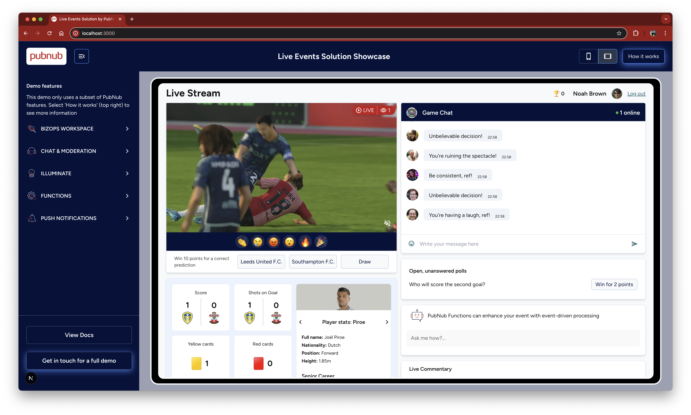

# PubNub Live Events Solution Demo

Solution showcase to demonstrate how PubNub can enhance your live event, whether it is a sports event, a concert, or any other streamed media event.

## Demo

A hosted version of this demo can be found at **[https://pn-solution-live-events.netlify.app/](https://pn-solution-live-events.netlify.app/)**



## Things to Try:

- React to the live stream by pressing the emoji below the video (if you press the buttons enough times, you will trigger events such as upgrades, and unlocked polls)
- Send messages in the chat window (log in under a separate window to receive the message)
- Participate in a poll
- Explore the left-hand menu, this shows the portal data that powers the demo: 
  - Users and Channels
  - Message moderation
  - Illuminate (to trigger events if you tap the reaction emoji enough times)
  - PubNub Functions


## What does this demo show?

- Mobile or Tablet view
- Number of people watching the live event (PubNub Presence)
- Reactions to the live event, e.g. cheering, anger, celebration (PubNub Messaging)
- Polls - Starting a poll as well as real-time voting and results (PubNub Messaging, and appropriate Channel architecture)
- Match stats in real-time and synchronized with the video feed (PubNub Messaging)
- Chat - Send and receive messages (PubNub Chat SDK)
- Chat - React to messages (PubNub Chat SDK)
- Chat - Number of people participating (PubNub Presence)
- Chat - Banning or Muting users (PubNub Channel Monitor)
- Chat - Tag a user and be notified when you are tagged (PubNub Chat SDK)
- How PubNub Functions can help extend the capabilities of the live event app
- Live Commentary (PubNub Messaging)
- Adverts, both static adverts as well as dynamic adverts triggered by Illuminate (PubNub Illuminate)
- Gamification: user can earn points as they click ads, predict the match outcome, and interact with polls (App Context, PubNub Illuminate)
- Gamification: Emoji can be upgraded if they are tapped enough (PubNub Illuminate)
- User and Channel Management (BizOps Workspace)
- Moderation (PubNub Channel Monitor)
- Push Messages for web 
- Push Messages on mobile (contact our sales for a demo of this)
- On-screen guides to show how each feature was implemented

## Installation / Getting Started

To run this project yourself you will need a PubNub account

<a href="https://admin.pubnub.com">
	
</a>

### Get Your PubNub Keys

1. You’ll first need to sign up for a [PubNub account](https://admin.pubnub.com/signup/). Once you sign up, you can get your unique PubNub keys from the [PubNub Developer Portal](https://admin.pubnub.com/).

1. Sign in to your [PubNub Dashboard](https://admin.pubnub.com/).

1. Click Apps, then **Create New App**.

1. Give your app a name, and click **Create**.

1. Click your new app to open its settings, then click its keyset.

1. Make sure your keyset has the following features enabled: Stream Controller, Presence, Persistence, App Context

1. Leave Access Manager disabled for now (this is not needed for testing)

1. Copy the Publish and Subscribe keys and paste them into your app as specified in the next step.

## Building and Running

1. Clone the repository 

1. You will need to install both the front-end and back-end application to get started

### Front-end

Rename the `.env.example` file found under the `web` directory to `.env` and populate it with your PubNub keys

```
cd pn-solution-live-events
cd web
yarn install
yarn dev

Navigate to localhost:3000 in your browser
```

### Back-end (In a separate terminal)

Rename the `.env.example` file found under the `backend` directory to `.env` and populate it with your PubNub keys.  Providing the secret key is only required if you enable Access Manager on your keyset.

```
cd pn-solution-live-events
cd backend
npm install
npm run generator
```

## Questions?

Please contact [devrel@pubnub.com](devrel@pubnub.com) or raise an issue in this repository.
